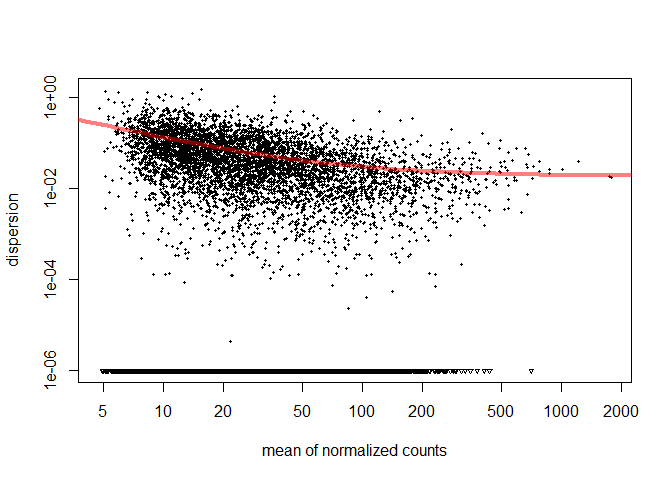
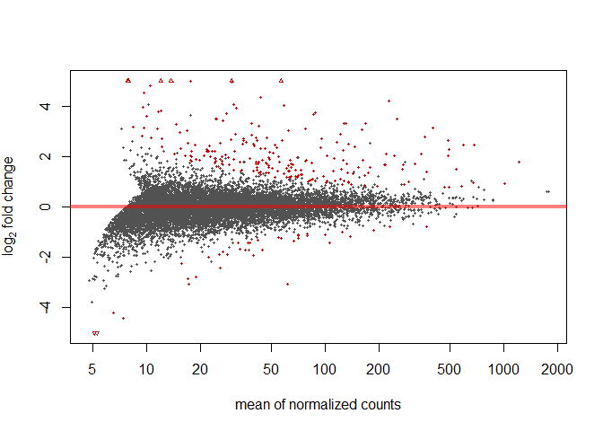
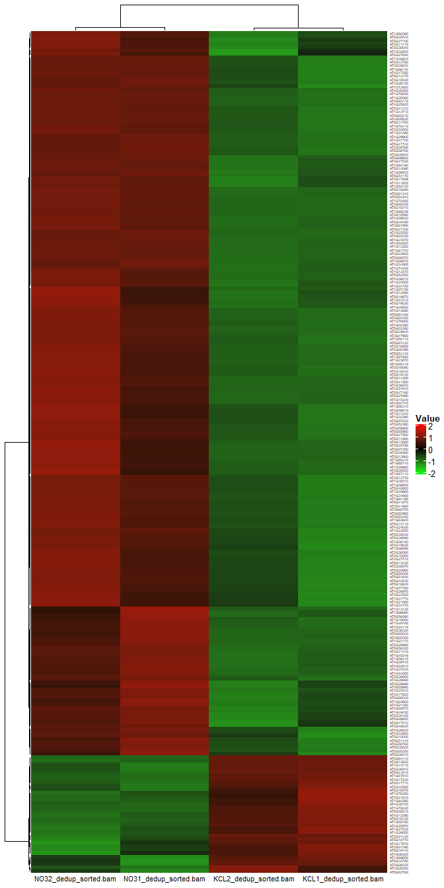

<!-- README.md is generated from README.Rmd. Please edit that file -->

# RNA-seq Analysis Workflow with DESeq in R

**Author**: Xiurui Zhu<br /> **Modified**: 2021-10-28 09:57:36<br />
**Compiled**: 2021-10-28 09:57:42

## Introduction

Next-generation sequencing (NGS) is a powerful tool for analyzing gene
sequences. There are a couple of packages that help to process NGS data,
including sequence alignment data, gene annotation, experimental
metadata and significance analysis. In this file, we will go through
this process according to [a tutorial for
RNA-seq](https://learn.gencore.bio.nyu.edu/rna-seq-analysis/deseq/) in
R.

## Methods

### Data preparation

To facilitate the analyses in the workflow, we need to load the
following packages: `tidyverse`, `magrittr`, `rlang`, `Rsamtools`,
`GenomicFeatures`, `GenomicAlignments`, `DESeq`, `DESeq2`, `GOstats`,
`GO.db`, `Category`, `org.At.tair.db` and `ComplexHeatmap`.

``` r
# Define a function to check, install (if necessary) and load packages
check_packages <- function(pkg_name,
                           repo = c("cran", "github", "Bioconductor"),
                           repo_path) {
  repo <- match.arg(repo)
  # Load installed packages
  inst_packages <- installed.packages()
  if (pkg_name %in% inst_packages == FALSE) {
    cat("* Installing: ", pkg_name, ", repo = ", repo, "\n", sep = "")
    switch(repo,
           cran = install.packages(pkg_name),
           github = {
             if ("devtools" %in% inst_packages == FALSE) {
               install.packages("devtools")
             }
             devtools::install_github(repo_path)
           },
           Bioconductor = {
             if ("BiocManager" %in% inst_packages == FALSE) {
               install.packages("BiocManager")
             }
             BiocManager::install(pkg_name)
           })
  } else {
    cat("* Package already installed: ", pkg_name, "\n", sep = "")
  }
  suppressPackageStartupMessages(
    library(pkg_name, character.only = TRUE)
  )
}

# CRAN packages
check_packages("tidyverse", repo = "cran")
purrr::walk(.x = c("magrittr", "rlang"),
            .f = check_packages, repo = "cran")
purrr::walk(.x = c("Rsamtools", "GenomicFeatures",
                   "GenomicAlignments", "DESeq",
                   "DESeq2", "GOstats", "GO.db",
                   "Category", "org.At.tair.db",
                   "ComplexHeatmap"),
            .f = check_packages, repo = "Bioconductor")
#> * Package already installed: tidyverse
#> * Package already installed: magrittr
#> * Package already installed: rlang
#> * Package already installed: Rsamtools
#> * Package already installed: GenomicFeatures
#> * Package already installed: GenomicAlignments
#> * Package already installed: DESeq
#> * Package already installed: DESeq2
#> * Package already installed: GOstats
#> * Package already installed: GO.db
#> * Package already installed: Category
#> * Package already installed: org.At.tair.db
#> * Package already installed: ComplexHeatmap
```

Alignment data from 4 “bam” files were loaded as pointers to data on
disk.

``` r
bam_files <- list.files("data", pattern = "\\.bam$", full.names = TRUE) %>%
  Rsamtools::BamFileList()
print(bam_files)
#> BamFileList of length 4
#> names(4): KCL1_dedup_sorted.bam KCL2_dedup_sorted.bam NO31_dedup_sorted.bam NO32_dedup_sorted.bam
```

Then, a “gtf” annotation file was loaded to locate genomic features and
exons were grouped by genes.

``` r
tx_db <- list.files("data", pattern = "\\.gtf$", full.names = TRUE) %>%
  GenomicFeatures::makeTxDbFromGFF(format="gtf")
#> Import genomic features from the file as a GRanges object ... OK
#> Prepare the 'metadata' data frame ... OK
#> Make the TxDb object ... OK
print(tx_db)
#> TxDb object:
#> # Db type: TxDb
#> # Supporting package: GenomicFeatures
#> # Data source: data/Arabidopsis.gtf
#> # Organism: NA
#> # Taxonomy ID: NA
#> # miRBase build ID: NA
#> # Genome: NA
#> # Nb of transcripts: 41671
#> # Db created by: GenomicFeatures package from Bioconductor
#> # Creation time: 2021-10-28 09:58:58 +0800 (Thu, 28 Oct 2021)
#> # GenomicFeatures version at creation time: 1.40.1
#> # RSQLite version at creation time: 2.2.8
#> # DBSCHEMAVERSION: 1.2

exon_by_gene <- tx_db %>%
  GenomicFeatures::exonsBy(by = "gene")
print(exon_by_gene)
#> GRangesList object of length 33610:
#> $AT1G01010
#> GRanges object with 6 ranges and 2 metadata columns:
#>       seqnames    ranges strand |   exon_id   exon_name
#>          <Rle> <IRanges>  <Rle> | <integer> <character>
#>   [1]     Chr1 3631-3913      + |         1        <NA>
#>   [2]     Chr1 3996-4276      + |         2        <NA>
#>   [3]     Chr1 4486-4605      + |         3        <NA>
#>   [4]     Chr1 4706-5095      + |         4        <NA>
#>   [5]     Chr1 5174-5326      + |         5        <NA>
#>   [6]     Chr1 5439-5899      + |         6        <NA>
#>   -------
#>   seqinfo: 7 sequences (2 circular) from an unspecified genome; no seqlengths
#> 
#> $AT1G01020
#> GRanges object with 12 ranges and 2 metadata columns:
#>        seqnames    ranges strand |   exon_id   exon_name
#>           <Rle> <IRanges>  <Rle> | <integer> <character>
#>    [1]     Chr1 5928-6263      - |     21880        <NA>
#>    [2]     Chr1 6437-7069      - |     21881        <NA>
#>    [3]     Chr1 6790-7069      - |     21882        <NA>
#>    [4]     Chr1 7157-7232      - |     21883        <NA>
#>    [5]     Chr1 7157-7450      - |     21884        <NA>
#>    ...      ...       ...    ... .       ...         ...
#>    [8]     Chr1 7762-7835      - |     21887        <NA>
#>    [9]     Chr1 7942-7987      - |     21888        <NA>
#>   [10]     Chr1 8236-8325      - |     21889        <NA>
#>   [11]     Chr1 8417-8464      - |     21890        <NA>
#>   [12]     Chr1 8571-8737      - |     21891        <NA>
#>   -------
#>   seqinfo: 7 sequences (2 circular) from an unspecified genome; no seqlengths
#> 
#> $AT1G01030
#> GRanges object with 2 ranges and 2 metadata columns:
#>       seqnames      ranges strand |   exon_id   exon_name
#>          <Rle>   <IRanges>  <Rle> | <integer> <character>
#>   [1]     Chr1 11649-13173      - |     21892        <NA>
#>   [2]     Chr1 13335-13714      - |     21893        <NA>
#>   -------
#>   seqinfo: 7 sequences (2 circular) from an unspecified genome; no seqlengths
#> 
#> ...
#> <33607 more elements>
```

Finally, experimental metadata were loaded for a description of the
dataset.

``` r
exp_design <- file.path("data", "expdesign.txt") %>%
  read.csv(row.names = 1L, sep = ",")
print(exp_design)
#>                       condition
#> KCL1_dedup_sorted.bam untreated
#> KCL2_dedup_sorted.bam untreated
#> NO31_dedup_sorted.bam   treated
#> NO32_dedup_sorted.bam   treated
```

### Read counting and filtering

Reads were first counted with exons grouped by genes.

``` r
summ_exp <- GenomicAlignments::summarizeOverlaps(
  features = exon_by_gene,
  reads = bam_files,
  mode = "Union",
  singleEnd = TRUE,
  ignore.strand = TRUE
)
print(summ_exp)
#> class: RangedSummarizedExperiment 
#> dim: 33610 4 
#> metadata(0):
#> assays(1): counts
#> rownames(33610): AT1G01010 AT1G01020 ... ATMG01400 ATMG01410
#> rowData names(0):
#> colnames(4): KCL1_dedup_sorted.bam KCL2_dedup_sorted.bam
#>   NO31_dedup_sorted.bam NO32_dedup_sorted.bam
#> colData names(0):

sam_count <- SummarizedExperiment::assay(summ_exp)
dim(sam_count)
#> [1] 33610     4
```

Median counts per condition in experimental metadata were counted and
maximal median counts \< 10 were removed.

``` r
count_thresh <- 10L
med_count <- sam_count %>%
  as.data.frame() %>%
  tibble::rownames_to_column("Feature_Name") %>%
  tidyr::pivot_longer(cols = !c("Feature_Name"),
                      names_to = "File_Name",
                      values_to = "value") %>%
  dplyr::inner_join(
    exp_design %>%
      tibble::rownames_to_column("File_Name"),
    by = "File_Name"
  ) %>%
  dplyr::group_by(Feature_Name, condition) %>%
  dplyr::summarize(med_value = median(value, na.rm = TRUE),
                   .groups = "drop") %>%
  tidyr::pivot_wider(id_cols = "Feature_Name",
                     names_from = "condition",
                     values_from = "med_value") %>%
  tibble::column_to_rownames("Feature_Name") %>%
  as.matrix()
max_med_count <- med_count %>%
  as.data.frame() %>%
  tibble::rownames_to_column("Feature_Name") %>%
  dplyr::mutate(max_count = pmax(!!!dplyr::syms(colnames(med_count)),
                                 na.rm = TRUE)) %>%
  dplyr::select(Feature_Name, max_count) %>%
  tibble::deframe()
sam_count_filter <- sam_count[
  names(max_med_count)[max_med_count >= count_thresh],
  1:ncol(sam_count)
]
dim(sam_count_filter)
#> [1] 11422     4
```

## Results

Statistical analyses were carried out with `DESeq` package.

### Exploration of differentially expressed genes

A count dataset (data container) was first constructed to analyze data
with `DESeq`. Then, size factors and variations were estimated.

``` r
count_deseq <- DESeq::newCountDataSet(
  countData = sam_count_filter,
  conditions = exp_design %>%
    tibble::rownames_to_column("File_Name") %>%
    tibble::deframe() %>%
    as.factor() %>%
    `[`(colnames(sam_count_filter))
) %>%
  DESeq::estimateSizeFactors() %>%
  DESeq::estimateDispersions()
print(count_deseq)
#> CountDataSet (storageMode: environment)
#> assayData: 11422 features, 4 samples 
#>   element names: counts 
#> protocolData: none
#> phenoData
#>   sampleNames: KCL1_dedup_sorted.bam KCL2_dedup_sorted.bam
#>     NO31_dedup_sorted.bam NO32_dedup_sorted.bam
#>   varLabels: sizeFactor condition
#>   varMetadata: labelDescription
#> featureData
#>   featureNames: AT1G01010 AT1G01040 ... AT5G67630 (11422 total)
#>   fvarLabels: disp_pooled
#>   fvarMetadata: labelDescription
#> experimentData: use 'experimentData(object)'
#> Annotation:
DESeq::plotDispEsts(count_deseq)
```



Next, univariate analysis was performed between the two groups define in
`exp_design` and a total of 208 significant genes were discovered.

``` r
count_univar <- count_deseq %>%
  DESeq::nbinomTest("untreated", "treated")
head(count_univar)
#>          id  baseMean baseMeanA baseMeanB foldChange log2FoldChange      pval
#> 1 AT1G01010  21.45700  27.32565  15.58834  0.5704655     -0.8097885 0.1238439
#> 2 AT1G01040  44.92871  39.63235  50.22508  1.2672748      0.3417294 0.3625881
#> 3 AT1G01050  14.11043  12.85400  15.36686  1.1954923      0.2576048 0.7524904
#> 4 AT1G01060  63.99045  71.62446  56.35645  0.7868324     -0.3458717 0.4788409
#> 5 AT1G01090  92.24328  80.91875 103.56782  1.2798990      0.3560299 0.2472544
#> 6 AT1G01100 180.46426 153.25272 207.67579  1.3551197      0.4384203 0.1022170
#>   padj
#> 1    1
#> 2    1
#> 3    1
#> 4    1
#> 5    1
#> 6    1
sig_count <- sum(count_univar[["padj"]] < 0.05, na.rm=T)
print(sig_count)
#> [1] 208
```

### MA plot

MA plot was used to indicate from the univariate results the required
fold change for a gene to be significant against its average count.

``` r
DESeq::plotMA(count_univar, ylim = c(-5, 5))
```



### Significant genes

Significant genes were derived from the univariate results.

``` r
sig_gene <- c(up = 1, down = -1) %>%
  purrr::map(~ {
    count_univar[count_univar[["padj"]] < 0.1 &
                   abs(count_univar[["log2FoldChange"]]) > 1 &
                   sign(count_univar[["log2FoldChange"]]) == .x, ]
  })
tibble::glimpse(sig_gene)
#> List of 2
#>  $ up  :'data.frame':    204 obs. of  8 variables:
#>   ..$ id            : chr [1:204] "AT1G03850" "AT1G07150" "AT1G08090" "AT1G08100" ...
#>   ..$ baseMean      : num [1:204] 33.3 28 400.4 130.5 44.5 ...
#>   ..$ baseMeanA     : num [1:204] 15.09 4.04 81.96 24.05 19.16 ...
#>   ..$ baseMeanB     : num [1:204] 51.5 51.9 718.8 237 69.8 ...
#>   ..$ foldChange    : num [1:204] 3.41 12.83 8.77 9.85 3.64 ...
#>   ..$ log2FoldChange: num [1:204] 1.77 3.68 3.13 3.3 1.87 ...
#>   ..$ pval          : num [1:204] 5.30e-05 3.34e-04 3.94e-06 4.78e-09 6.30e-06 ...
#>   ..$ padj          : num [1:204] 5.06e-03 2.33e-02 6.25e-04 1.48e-06 8.89e-04 ...
#>  $ down:'data.frame':    33 obs. of  8 variables:
#>   ..$ id            : chr [1:33] "AT1G13110" "AT1G27030" "AT1G29050" "AT1G55760" ...
#>   ..$ baseMean      : num [1:33] 54.8 56.7 79.5 19 61.7 ...
#>   ..$ baseMeanA     : num [1:33] 76.6 79.8 109.6 33.2 110.3 ...
#>   ..$ baseMeanB     : num [1:33] 33.07 33.63 49.45 4.79 13.14 ...
#>   ..$ foldChange    : num [1:33] 0.432 0.421 0.451 0.144 0.119 ...
#>   ..$ log2FoldChange: num [1:33] -1.21 -1.25 -1.15 -2.8 -3.07 ...
#>   ..$ pval          : num [1:33] 1.09e-03 1.02e-03 6.33e-04 2.25e-05 1.66e-04 ...
#>   ..$ padj          : num [1:33] 0.05763 0.05464 0.03745 0.00259 0.01306 ...
sig_gene_comb <- dplyr::bind_rows(sig_gene)
head(sig_gene_comb)
#>          id  baseMean baseMeanA baseMeanB foldChange log2FoldChange
#> 1 AT1G03850  33.27369 15.093992  51.45338   3.408865       1.769291
#> 2 AT1G07150  27.96515  4.044117  51.88618  12.830039       3.681454
#> 3 AT1G08090 400.35951 81.960358 718.75867   8.769589       3.132509
#> 4 AT1G08100 130.50403 24.051723 236.95633   9.851948       3.300409
#> 5 AT1G08650  44.49139 19.162379  69.82040   3.643618       1.865372
#> 6 AT1G11655   8.48047  1.704820  15.25612   8.948818       3.161697
#>           pval         padj
#> 1 5.300576e-05 5.058579e-03
#> 2 3.339807e-04 2.334359e-02
#> 3 3.937001e-06 6.245615e-04
#> 4 4.781152e-09 1.475954e-06
#> 5 6.301214e-06 8.885490e-04
#> 6 6.813422e-04 3.930450e-02
```

### Gene annotations

The functions of genes were annotated with data from [an open-source
“tair”
repository](https://www.arabidopsis.org/download/index-auto.jsp%3Fdir%3D%252Fdownload_files%252FGenes%252FTAIR10_genome_release).
Transcript identifiers ending with a dot and a number were removed for
matching.

``` r
gene_desc <- list.files("data",
                        pattern = "^gene_description",
                        full.names = TRUE) %>%
  readr::read_delim(col_types = readr::cols(),
                    delim = "\t",
                    col_names = NULL) %>%
  dplyr::mutate_at("X1",
                   ~ .x %>%
                     stringr::str_replace("\\.[0-9]$", "")) %>%
  dplyr::semi_join(
    sig_gene_comb,
    by = c("X1" = "id")
  ) %>%
  `colnames<-`(c("id", "class", "annotation", "function", "detail"))
head(gene_desc[c("id", "annotation")])
#> # A tibble: 6 x 2
#>   id        annotation                                       
#>   <chr>     <chr>                                            
#> 1 AT1G49860 glutathione S-transferase (class phi) 14         
#> 2 AT1G07150 mitogen-activated protein kinase kinase kinase 13
#> 3 AT1G22500 RING/U-box superfamily protein                   
#> 4 AT1G49450 Transducin/WD40 repeat-like superfamily protein  
#> 5 AT1G19050 response regulator 7                             
#> 6 AT1G14340 RNA-binding (RRM/RBD/RNP motifs) family protein
```

### Go-term enrichment analysis

Go-term enrichment analysis was first performed with the significant
genes from filtered count matrix.

``` r
go_params <- new(
  "GOHyperGParams",
  geneIds = sig_gene_comb[["id"]],
  universeGeneIds = rownames(sam_count_filter),
  annotation = "org.At.tair",
  ontology = "BP",
  pvalueCutoff = 0.001,
  conditional = TRUE,
  testDirection = "over"
)
print(go_params)
#> A GOHyperGParams instance
#>   category: GO 
#> annotation: org.At.tair
over_rep <- Category::hyperGTest(go_params)
print(summary(over_rep)[, c(1L, 2L, 5L, 6L, 7L)])
#>        GOBPID       Pvalue Count Size
#> 1  GO:0010167 1.596988e-06     6   18
#> 2  GO:0042221 1.810717e-05    64 1774
#> 3  GO:0009051 4.358056e-05     4   10
#> 4  GO:0006739 4.983977e-05     6   31
#> 5  GO:0006820 6.187222e-05    13  163
#> 6  GO:0042128 6.730251e-05     4   11
#> 7  GO:0055114 1.465420e-04    20  363
#> 8  GO:0019676 2.016793e-04     3    6
#> 9  GO:2001057 2.597026e-04     4   15
#> 10 GO:0009735 4.465533e-04     7   63
#> 11 GO:0046942 4.921617e-04     7   64
#> 12 GO:0006082 5.310063e-04    29  688
#> 13 GO:0016052 5.379109e-04     9  106
#> 14 GO:0006091 6.283807e-04    13  206
#> 15 GO:0001666 8.751107e-04    12  187
#>                                              Term
#> 1                             response to nitrate
#> 2                            response to chemical
#> 3       pentose-phosphate shunt, oxidative branch
#> 4                          NADP metabolic process
#> 5                                 anion transport
#> 6                            nitrate assimilation
#> 7                     oxidation-reduction process
#> 8                      ammonia assimilation cycle
#> 9     reactive nitrogen species metabolic process
#> 10                          response to cytokinin
#> 11                      carboxylic acid transport
#> 12                 organic acid metabolic process
#> 13                 carbohydrate catabolic process
#> 14 generation of precursor metabolites and energy
#> 15                            response to hypoxia
```

### Heatmap and hierarchical clustering

The `rlog`-normalized count matrix (significant genes only) was
visualized with heatmap.

``` r
sig_heatmap_data <- sam_count_filter %>%
  {
    `rownames<-`(
      DESeq2::rlog(., blind = FALSE),
      rownames(.)
    )
  } %>%
  `[`(sig_gene_comb[["id"]], 1:ncol(.))
sig_heatmap <- sig_heatmap_data %>%
  {
    `colnames<-`(
      apply(., MARGIN = 1L, scale) %>%
        t(),
      colnames(.)
    )
  } %>%
  ComplexHeatmap::Heatmap(
    col = circlize::colorRamp2(c(-2, 0, 2),
                               c("#00FF00", "#000000", "#FF0000")),
    name = "Value",
    cluster_rows = TRUE,
    cluster_columns = TRUE,
    clustering_method_rows = "average",
    clustering_method_columns = "average",
    clustering_distance_rows = function(x) {
      as.dist(1 - cor(t(x), method = "pearson"))
    },
    clustering_distance_columns = function(x) {
      as.dist(1 - cor(t(x), method = "pearson"))
    },
    row_names_gp = grid::gpar(fontsize = 4),
    column_names_gp = grid::gpar(fontsize = 8),
    column_names_rot = 0,
    column_names_centered = TRUE,
    heatmap_width = grid::unit(1, "native"),
    heatmap_height = grid::unit(2, "native")
  )
ComplexHeatmap::draw(sig_heatmap)
```



## Conclusion

In this workflow, we first prepared RNA-seq data from aligned “bam”
files and turned the dataset into a count matrix with filtered gene
reads. Then differentiating genes were discovered by univariate analysis
with adjusted p-values and fold changes. Finally, significant genes went
through GO enrichment analysis and the results were visualized with
heatmaps.

## Session info

This file was compiled with the following packages and versions:

``` r
utils::sessionInfo()
#> R version 4.0.5 (2021-03-31)
#> Platform: x86_64-w64-mingw32/x64 (64-bit)
#> Running under: Windows 10 x64 (build 19042)
#> 
#> Matrix products: default
#> 
#> locale:
#> [1] LC_COLLATE=Chinese (Simplified)_China.936 
#> [2] LC_CTYPE=Chinese (Simplified)_China.936   
#> [3] LC_MONETARY=Chinese (Simplified)_China.936
#> [4] LC_NUMERIC=C                              
#> [5] LC_TIME=Chinese (Simplified)_China.936    
#> 
#> attached base packages:
#>  [1] grid      stats4    parallel  stats     graphics  grDevices utils    
#>  [8] datasets  methods   base     
#> 
#> other attached packages:
#>  [1] ComplexHeatmap_2.4.3        org.At.tair.db_3.11.4      
#>  [3] GO.db_3.11.4                GOstats_2.54.0             
#>  [5] graph_1.66.0                Category_2.54.0            
#>  [7] Matrix_1.3-2                DESeq2_1.28.1              
#>  [9] DESeq_1.39.0                lattice_0.20-41            
#> [11] locfit_1.5-9.4              GenomicAlignments_1.24.0   
#> [13] SummarizedExperiment_1.18.2 DelayedArray_0.14.1        
#> [15] matrixStats_0.56.0          GenomicFeatures_1.40.1     
#> [17] AnnotationDbi_1.50.3        Biobase_2.48.0             
#> [19] Rsamtools_2.4.0             Biostrings_2.56.0          
#> [21] XVector_0.28.0              GenomicRanges_1.40.0       
#> [23] GenomeInfoDb_1.24.2         IRanges_2.22.2             
#> [25] S4Vectors_0.26.1            BiocGenerics_0.34.0        
#> [27] rlang_0.4.11                magrittr_2.0.1             
#> [29] forcats_0.5.1               stringr_1.4.0              
#> [31] dplyr_1.0.7                 purrr_0.3.4                
#> [33] readr_2.0.1                 tidyr_1.1.3                
#> [35] tibble_3.1.3                ggplot2_3.3.5              
#> [37] tidyverse_1.3.1            
#> 
#> loaded via a namespace (and not attached):
#>  [1] colorspace_1.4-1       rjson_0.2.20           ellipsis_0.3.2        
#>  [4] circlize_0.4.13        GlobalOptions_0.1.2    fs_1.5.0              
#>  [7] clue_0.3-60            rstudioapi_0.13        bit64_4.0.5           
#> [10] fansi_0.4.2            lubridate_1.7.10       xml2_1.3.2            
#> [13] splines_4.0.5          cachem_1.0.4           geneplotter_1.66.0    
#> [16] knitr_1.29             jsonlite_1.7.2         broom_0.7.9           
#> [19] annotate_1.66.0        cluster_2.1.1          dbplyr_2.1.1          
#> [22] png_0.1-7              compiler_4.0.5         httr_1.4.2            
#> [25] backports_1.1.8        assertthat_0.2.1       fastmap_1.0.1         
#> [28] cli_3.0.1              htmltools_0.5.0        prettyunits_1.1.1     
#> [31] tools_4.0.5            gtable_0.3.0           glue_1.4.2            
#> [34] GenomeInfoDbData_1.2.3 rappdirs_0.3.3         Rcpp_1.0.7            
#> [37] cellranger_1.1.0       vctrs_0.3.8            rtracklayer_1.48.0    
#> [40] xfun_0.15              rvest_1.0.1            lifecycle_1.0.0       
#> [43] XML_3.99-0.4           zlibbioc_1.34.0        scales_1.1.1          
#> [46] vroom_1.5.4            hms_1.1.0              RBGL_1.64.0           
#> [49] RColorBrewer_1.1-2     yaml_2.2.1             curl_4.3              
#> [52] memoise_2.0.0          biomaRt_2.44.4         stringi_1.4.6         
#> [55] RSQLite_2.2.8          genefilter_1.70.0      BiocParallel_1.22.0   
#> [58] shape_1.4.5            pkgconfig_2.0.3        bitops_1.0-6          
#> [61] evaluate_0.14          bit_4.0.4              tidyselect_1.1.0      
#> [64] AnnotationForge_1.30.1 GSEABase_1.50.1        R6_2.4.1              
#> [67] snow_0.4-3             generics_0.1.0         DBI_1.1.0             
#> [70] pillar_1.6.2           haven_2.4.3            withr_2.4.1           
#> [73] survival_3.2-10        RCurl_1.98-1.2         modelr_0.1.8          
#> [76] crayon_1.4.1           utf8_1.1.4             BiocFileCache_1.12.1  
#> [79] tzdb_0.1.2             rmarkdown_2.3          GetoptLong_1.0.5      
#> [82] progress_1.2.2         readxl_1.3.1           Rgraphviz_2.32.0      
#> [85] blob_1.2.1             reprex_2.0.1           digest_0.6.25         
#> [88] xtable_1.8-4           openssl_1.4.2          munsell_0.5.0         
#> [91] askpass_1.1
```
